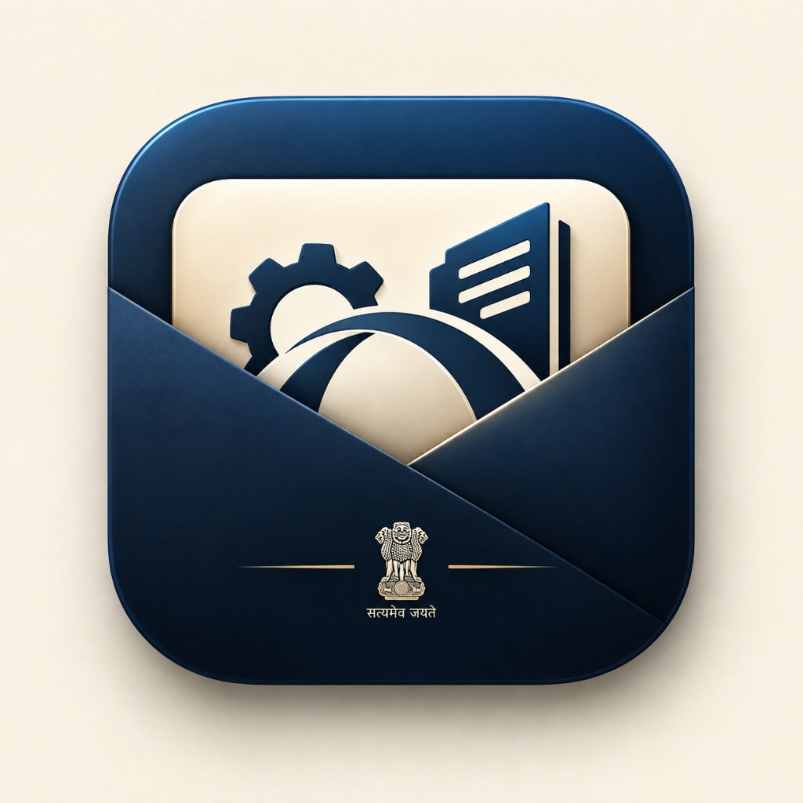
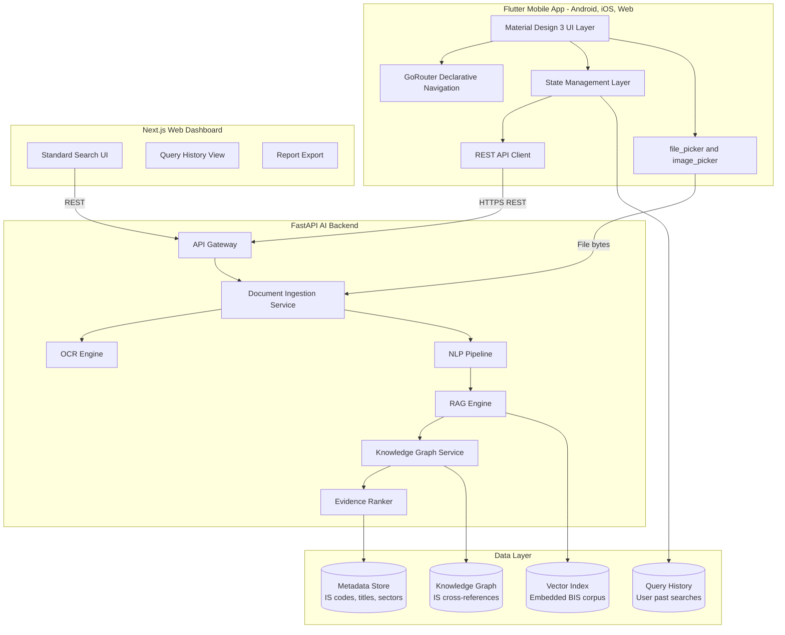
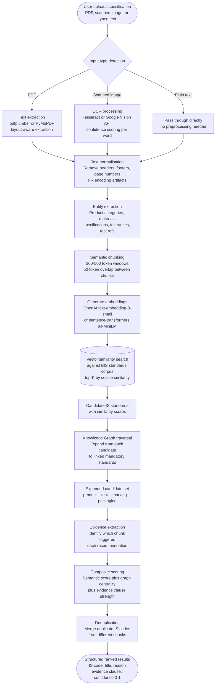
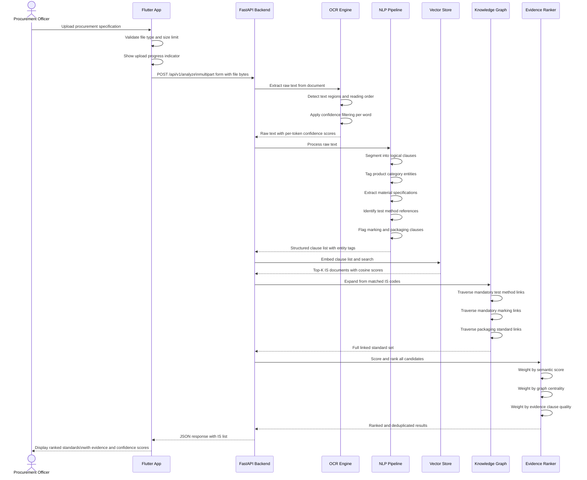
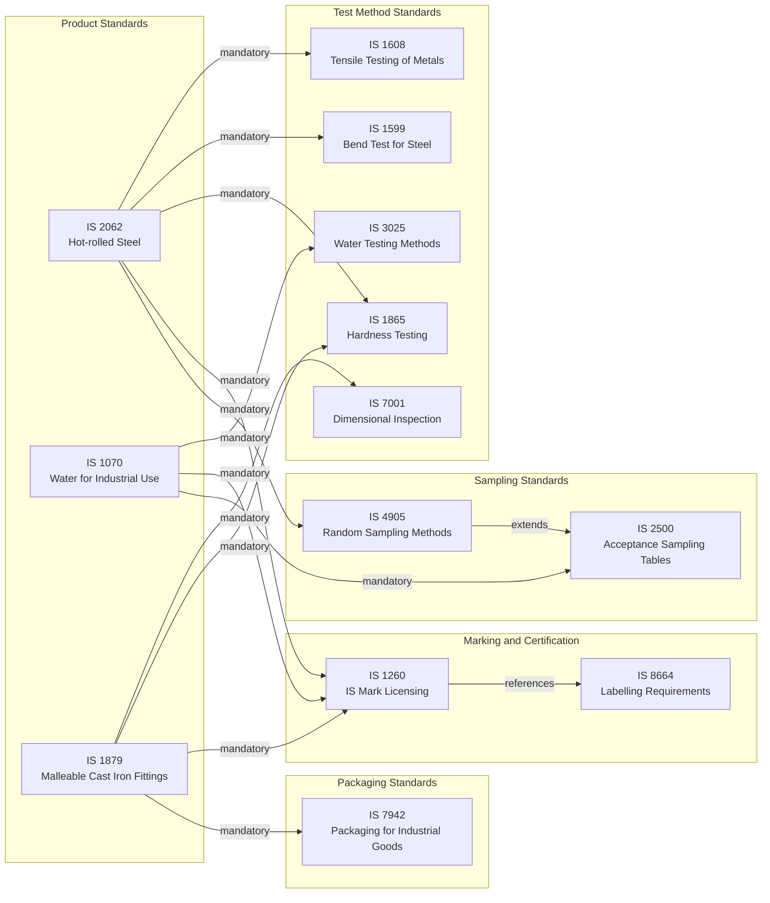
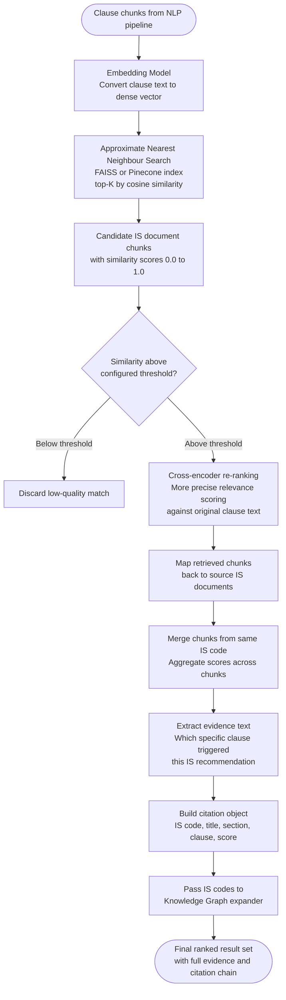
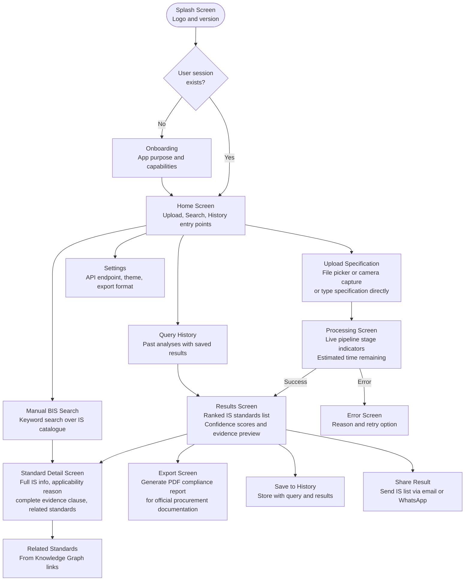
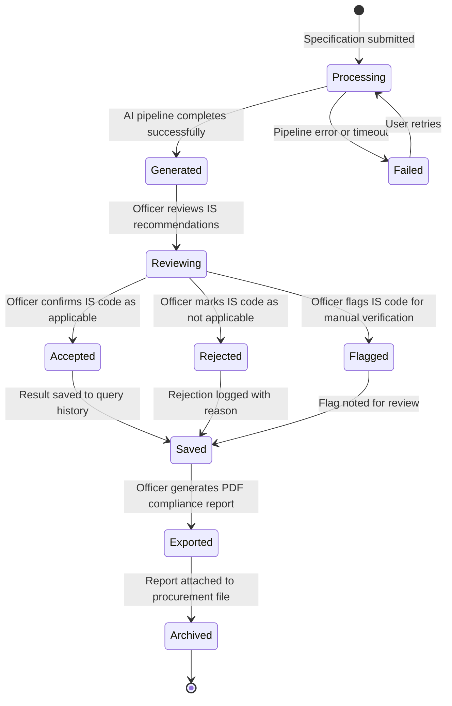
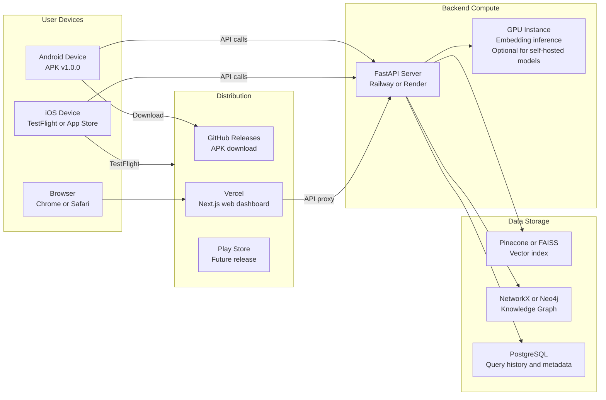

<div align="center">

<a href="https://github.com/hardikkaurani/Manaksetu-MA/releases/download/v1.0.0/ManakSetu-Mobile-v1.0.0.apk" target="_blank">
  
</a>

<h1>Manaksetu &nbsp;·&nbsp; ( मानकसेतु ) </h1>

<p><strong>An AI-powered, evidence-first mobile platform for identifying applicable Indian Standards (BIS)<br/>from procurement specifications — built for procurement officers, quality managers,<br/>and compliance teams across India's public and private sector.</strong></p>


<br/><br/>

</div>

---

## Download

<div align="center">

| Platform | Link | Notes |
|---|---|---|
| Android APK | [ManakSetu-Mobile-v1.0.0.apk](https://github.com/hardikkaurani/Manaksetu-MA/releases/download/v1.0.0/ManakSetu-Mobile-v1.0.0.apk) | Android 5.0+ (API 21+) |
| GitHub Release | [v1.0.0 Release Page](https://github.com/hardikkaurani/Manaksetu-MA/releases/tag/v1.0.0) | Full release notes and assets |

</div>

> **Android Installation**: Download the APK, open it on your device. If prompted, enable "Install from unknown sources" under Settings > Security > Install unknown apps.

---

## Table of Contents

- [The Problem](#the-problem)
- [The Solution](#the-solution)
- [System Architecture](#system-architecture)
- [AI Standards Identification Pipeline](#ai-standards-identification-pipeline)
- [Document Intelligence Flow](#document-intelligence-flow)
- [Knowledge Graph — Standards Relationships](#knowledge-graph--standards-relationships)
- [RAG Pipeline — Internal Mechanics](#rag-pipeline--internal-mechanics)
- [Application Navigation and Screen Flow](#application-navigation-and-screen-flow)
- [Compliance Result Lifecycle](#compliance-result-lifecycle)
- [Deployment Architecture](#deployment-architecture)
- [Tech Stack](#tech-stack)
- [Indian Standards Coverage](#indian-standards-coverage)
- [Project Structure](#project-structure)
- [Key Design Decisions](#key-design-decisions)
- [Environment Configuration](#environment-configuration)
- [Getting Started — Build from Source](#getting-started--build-from-source)
- [Contributing](#contributing)
- [License](#license)

---

## The Problem

India's procurement ecosystem — spanning GeM (Government e-Marketplace), public sector undertakings, defence procurement, and large-scale infrastructure projects — requires all purchased goods and services to conform to applicable BIS (Bureau of Indian Standards) standards. However, the process of identifying which standards apply is broken at every level:

| Pain Point | Reality |
|---|---|
| Standards identification is manual | Procurement officers manually read through thousands of IS documents to find applicable standards for a given specification |
| Specifications arrive unstructured | Procurement documents are PDFs, scanned images, and free-form text with no machine-readable clause structure |
| Standards landscape is vast | BIS has over 20,000 active Indian Standards across sectors — no single officer can know all applicable codes |
| Cross-references are hidden | A single product may fall under multiple IS codes spanning material, testing, packaging, and marking standards |
| Errors carry legal consequences | Non-compliance with BIS standards during procurement leads to rejected goods, audit findings, financial penalties, and legal liability |
| No feedback loop | Officers have no way to know if they have missed an applicable standard until audit or delivery failure |

The result: compliance is inconsistent, slow, and dependent entirely on the expertise and memory of individual procurement officers.

---

## The Solution

Manaksetu is a mobile-first AI platform that accepts a procurement specification — as text, PDF, or captured image — and returns a ranked, evidence-linked list of applicable Indian Standards with the specific clauses and rationale for each recommendation.

The name **Manaksetu** (मानकसेतु) means "bridge to standards" in Sanskrit — a bridge between raw procurement language and India's formal standards framework.

The core operational flow:

```
Upload Specification
        |
        v
Document Intelligence Layer
(OCR + clause extraction + entity recognition)
        |
        v
RAG Pipeline
(Semantic search over embedded BIS standards corpus)
        |
        v
Knowledge Graph Traversal
(Expand to related test, marking, packaging standards)
        |
        v
Evidence-First Ranking
(Each recommendation linked to source clause)
        |
        v
Structured Output
(IS code, title, applicability reason, confidence, evidence)
```

---

## System Architecture

The complete component topology of Manaksetu — from the Flutter mobile client through the AI backend, vector store, knowledge graph, and web dashboard.



---

## AI Standards Identification Pipeline

The complete flow from raw document input to a ranked, evidence-linked list of applicable Indian Standards — across six sequential stages.



---

## Document Intelligence Flow

How unstructured procurement documents — including poor-quality scans — are parsed into structured, clause-level representations ready for the AI pipeline.



---

## Knowledge Graph — Standards Relationships

BIS standards are not isolated. Each IS product standard references mandatory test method standards, marking standards, and packaging standards. Manaksetu's Knowledge Graph pre-computes these relationships so a single specification match expands into the full compliance tree automatically.



---

## RAG Pipeline — Internal Mechanics

How the Retrieval-Augmented Generation pipeline retrieves, ranks, and cites evidence from the embedded BIS corpus — the engine that makes recommendations trustworthy rather than opaque.



---

## Application Navigation and Screen Flow



---

## Compliance Result Lifecycle

How a single compliance result moves from generation through use in the procurement process — covering editing, export, and audit trail.



---

## Deployment Architecture



---

## Tech Stack

### Mobile Application

| Technology | Version | Purpose |
|---|---|---|
| Flutter | 3.x | Cross-platform mobile and web UI |
| Dart | 3.11+ | Type-safe application code |
| GoRouter | 14.0–18.0 | Declarative URL-based navigation |
| file_picker | 12.3.0 | PDF and document selection from device storage |
| image_picker | 1.1.2 | Camera capture and gallery selection |
| flutter_launcher_icons | 0.14.3 | App icon generation for Android and iOS |

### AI Backend

| Technology | Purpose |
|---|---|
| FastAPI | High-performance async Python REST API |
| RAG Pipeline | Retrieval-Augmented Generation over BIS standards corpus |
| Sentence Transformers | Open-source embedding model for semantic search |
| FAISS | High-speed approximate nearest-neighbour vector search |
| Cross-encoder | Re-ranking model for precision improvement on top-K candidates |
| Knowledge Graph (NetworkX) | Standards relationship traversal and expansion |
| Tesseract OCR | Text extraction from scanned and image-based documents |
| NLP pipeline (spaCy) | Entity extraction, clause segmentation, product category tagging |

### Web Dashboard

| Technology | Purpose |
|---|---|
| Next.js | Server-rendered web interface for desktop procurement officers |
| Vercel | Zero-configuration deployment with edge caching |

### Infrastructure

| Component | Technology |
|---|---|
| Backend hosting | Railway or Render |
| Vector index | Pinecone (managed) or FAISS (self-hosted) |
| Knowledge graph | NetworkX (in-memory) or Neo4j (persistent) |
| Database | PostgreSQL for query history and metadata |
| APK distribution | GitHub Releases |

---

## Indian Standards Coverage

Manaksetu's corpus covers BIS standards across major procurement sectors:

| Sector | Example IS Codes | Scope |
|---|---|---|
| Steel and metals | IS 2062, IS 1608, IS 1570, IS 808 | Structural steel, testing methods, bars and rods |
| Electrical equipment | IS 732, IS 1646, IS 3043, IS 10810 | Wiring, earthing, cable testing |
| Construction materials | IS 456, IS 269, IS 8112, IS 1489 | Concrete, cement, fly ash cement |
| Water and sanitation | IS 1070, IS 3025, IS 458, IS 4111 | Industrial water, testing, pipes |
| Chemicals and industrial | IS 265, IS 1030, IS 797 | Chemical purity, castings |
| Textiles | IS 1963, IS 6490, IS 1965 | Yarn, fabric, tolerance |
| Food and agriculture | IS 1009, IS 4883, IS 2809 | Food grading, agricultural equipment |
| Mechanical equipment | IS 3832, IS 7895, IS 4218 | Fasteners, valves, threads |

---

## Project Structure

```
Manaksetu-MA/
|
+-- lib/
|   +-- main.dart                        # App entry point, GoRouter configuration
|   +-- core/
|   |   +-- constants/
|   |   |   +-- api_constants.dart       # API base URL, endpoint paths, timeout values
|   |   |   +-- app_strings.dart         # All user-facing strings (i18n-ready)
|   |   +-- theme/
|   |   |   +-- app_theme.dart           # Material 3 navy and cream color scheme
|   |   +-- extensions/
|   |   |   +-- string_extensions.dart
|   |   |   +-- context_extensions.dart
|   |   +-- services/
|   |       +-- api_service.dart         # HTTP client, error handling, retry logic
|   |       +-- file_service.dart        # File validation, format detection, compression
|   |       +-- history_service.dart     # Local query history persistence
|   |
|   +-- features/
|       +-- splash/
|       |   +-- splash_screen.dart
|       +-- onboarding/
|       |   +-- onboarding_screen.dart
|       +-- home/
|       |   +-- home_screen.dart         # Entry point with upload, search, history tiles
|       +-- upload/
|       |   +-- upload_screen.dart       # File picker, camera, and text input flow
|       |   +-- processing_screen.dart   # Pipeline stage indicator with live progress
|       +-- results/
|       |   +-- results_screen.dart      # Ranked IS standards list with confidence bars
|       |   +-- standard_detail.dart     # Full IS detail with evidence clause display
|       |   +-- export_screen.dart       # PDF compliance report generation
|       |   +-- share_screen.dart        # Share via email or messaging
|       +-- search/
|       |   +-- search_screen.dart       # Manual BIS keyword search with filters
|       +-- history/
|       |   +-- history_screen.dart      # Past query list with replay capability
|       +-- settings/
|           +-- settings_screen.dart     # API endpoint, theme, export format
|
+-- assets/
|   +-- branding/
|   |   +-- manaksetu_app_icon.png       # Navy envelope with Ashoka Chakra and Satyameva Jayate
|   +-- images/
|       +-- sample_clause.jpg            # Demo procurement specification for onboarding
|
+-- android/                             # Android platform configuration
+-- ios/                                 # iOS platform configuration
+-- web/                                 # Web platform configuration
+-- windows/                             # Windows platform configuration
+-- test/
|   +-- widget/
|   +-- integration/
+-- docs/                                # Architecture documentation
+-- pubspec.yaml                         # Dependencies and asset declarations
+-- implmentation plan.txt               # Detailed implementation roadmap
+-- manaksetu_mock_data.md               # Mock BIS standards data for development and testing
+-- analysis_options.yaml                # Dart linting rules
+-- LICENSE                              # Apache 2.0
+-- README.md
```

---

## Key Design Decisions

**Why evidence-first output rather than just IS code lists?**
A compliance recommendation without justification is legally unusable in a government procurement context. Every IS code returned by Manaksetu is linked to the specific clause in the procurement specification that triggered the recommendation, and the specific section of the BIS standard that makes it applicable. Procurement officers can verify each recommendation independently without trusting the AI blindly — critical for audit defence.

**Why a Knowledge Graph in addition to vector search?**
Vector search retrieves the primary product standard that semantically matches the specification. But procurement compliance also requires mandatory test method standards, marking and licensing standards (IS 1260), and packaging standards — which are referenced within the primary standard, not in the procurement specification itself. The Knowledge Graph pre-computes these relationships so one match expands into the full compliance tree, automatically.

**Why RAG over a fine-tuned model?**
BIS standards are amended and new IS codes are added periodically by the Bureau of Indian Standards. A fine-tuned model would require complete retraining on every standards update — infeasible for a lean team. A RAG pipeline with a continuously updated vector index adapts to new or revised IS documents with an index update operation only, no model changes required.

**Why Flutter for a government-focused compliance tool?**
Flutter produces a single codebase that runs on Android phones used by field procurement officers, iOS devices used by quality managers, and Chrome browsers used by desk-based compliance teams at GeM or CPWD. One codebase, three deployment targets, identical UI fidelity and behaviour across all three platforms.

**Why GoRouter for navigation?**
GoRouter provides URL-based deep linking that works identically on Android, iOS, and web. A compliance officer using the web dashboard can share a direct URL pointing to a specific search result or standard detail with a colleague. This is not possible with Flutter's default imperative Navigator without significant additional engineering.

**Why cross-encoder re-ranking after vector search?**
Vector similarity (bi-encoder) search is fast but approximate — it retrieves a wide candidate set efficiently. Cross-encoder re-ranking is slower but more precise — it scores each candidate against the original query text with full attention. Combining both stages gives the accuracy of cross-encoder ranking at near the speed of vector search, by applying the cross-encoder only to the top-K candidates from the vector stage.

---

## Environment Configuration

```dart
// lib/core/constants/api_constants.dart
const String kApiBaseUrl = 'https://your-fastapi-backend.com';
const String kApiVersion = '/api/v1';
const int kApiTimeoutSeconds = 30;
const int kMaxFileSizeMb = 10;
```

For local development, point `kApiBaseUrl` to `http://localhost:8000` and run the FastAPI backend locally.

---

## Getting Started — Build from Source

### Prerequisites

| Requirement | Version |
|---|---|
| Flutter SDK | 3.x (Dart 3.11+) |
| Android Studio or VS Code | Latest with Flutter and Dart plugins |
| Android SDK | API 21+ |
| Java | 17+ |

### Build and Run

```bash
# Clone the repository
git clone https://github.com/hardikkaurani/Manaksetu-MA.git
cd Manaksetu-MA

# Install dependencies
flutter pub get

# Generate app icons from assets/branding/manaksetu_app_icon.png
dart run flutter_launcher_icons

# Run on connected Android device
flutter run -d android

# Run on Chrome (web)
flutter run -d chrome

# Build signed release APK
flutter build apk --release
# Output: build/app/outputs/flutter-apk/app-release.apk
```

### Run Flutter Analysis and Tests

```bash
# Static analysis
flutter analyze

# Run tests
flutter test

# Format code
dart format .
```

---

## Contributing

```bash
git checkout -b feat/your-feature-name
git commit -m "feat(scope): describe your change"
git push origin feat/your-feature-name
# Open a Pull Request
```

Follow [Conventional Commits](https://www.conventionalcommits.org/).

For adding new BIS standards to the corpus, add the IS document to the corpus ingestion pipeline and update the Knowledge Graph relationship definitions. See `implmentation plan.txt` for the corpus update workflow.

---

## License

Apache License 2.0. See [LICENSE](LICENSE) for details.

---

<div align="center">

<a href="https://github.com/hardikkaurani/Manaksetu-MA/releases/download/v1.0.0/ManakSetu-Mobile-v1.0.0.apk">
  
</a>

<br/><br/>
**Manaksetu — मानकसेतु**
*A bridge between procurement language and Indian Standards.*
<br/>

<a href="https://github.com/hardikkaurani/Manaksetu-MA/releases/download/v1.0.0/ManakSetu-Mobile-v1.0.0.apk">
  
</a>
&nbsp;
<a href="https://github.com/hardikkaurani/Manaksetu-MA/releases/tag/v1.0.0">
  
</a>

<br/><br/>

Built by [Hardik Kaurani](https://github.com/hardikkaurani) & [Aadi Jain](https://github.com/Thrizzio)

</div>
